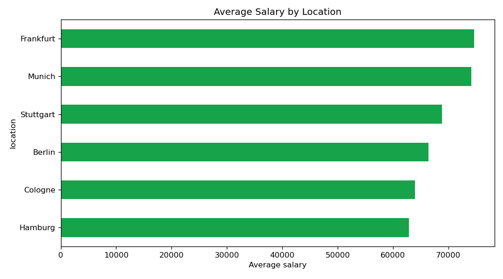
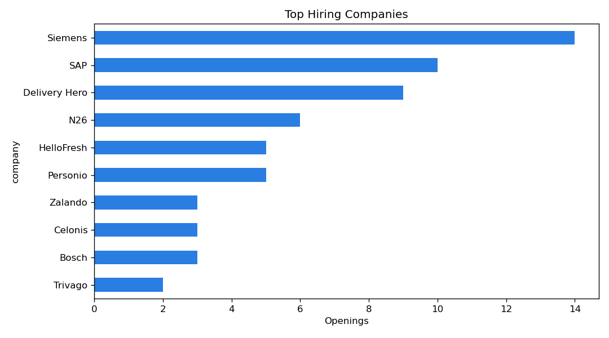

# Adzuna Job Fetcher
https://roadmap.sh/projects/job-listings-scraper
A clean Python tool that pulls real job listings from the **[Adzuna API](https://developer.adzuna.com/)**
and saves them to a CSV file. Unlike scraping LinkedIn or Indeed, this uses an
official, permitted API — no anti-bot issues and no Terms-of-Service problems.

## What it collects

For each job:
- Job title
- Company name
- Location
- Salary (min / max, when available)
- Job URL
- Date posted

## Tech stack

- **Python**
- **requests** — call the Adzuna REST API
- **csv** — save the results
- **argparse** — simple command-line options

## Setup

1. **Get free API keys:** sign up at [developer.adzuna.com](https://developer.adzuna.com/),
   create an app, and copy your **App ID** and **App Key**.

2. **Install dependencies:**
   ```bash
   pip install -r requirements.txt
   ```

3. **Set your credentials** (they are read from environment variables, never hard-coded):
   ```bash
   export ADZUNA_APP_ID="your_app_id"
   export ADZUNA_APP_KEY="your_app_key"
   ```

## Usage

```bash
# default search (python developer jobs in Germany)
python fetcher.py

# custom search
python fetcher.py --what "data scientist" --where "Berlin" --country de --pages 2
```

### Options

| Flag | Description | Default |
|---|---|---|
| `--what` | Job title / keywords | `python developer` |
| `--where` | Location | (any) |
| `--country` | Country code (`de`, `gb`, `us`, …) | `de` |
| `--pages` | Number of result pages (50 jobs each) | `1` |

Output is written to `adzuna_jobs.csv`.

### Example output

| title | company | location | salary_min | salary_max | url | created |
|---|---|---|---|---|---|---|
| Data Scientist | Example GmbH | Berlin | 60000 | 80000 | https://… | 2026-06-09T… |

## Analysis

`analyze.py` reads the jobs CSV and produces a summary report plus charts.

```bash
# analyse your fetched data
python analyze.py

# or try it instantly on the included demo data (no API key needed)
python analyze.py --file sample_jobs.csv
```

It outputs:
- a printed summary (job counts, median/average salary)
- **`report.md`** — a Markdown report with tables
- **`charts/`** — `top_companies.png`, `avg_salary_by_location.png`, `salary_distribution.png`

Example insights from the demo data:




> `sample_jobs.csv` is included so anyone can run the analysis without API keys.

## Notes

- API keys are loaded from environment variables and are **never committed**
  (see `.gitignore`).
- The free Adzuna tier is rate-limited; keep `--pages` modest.
