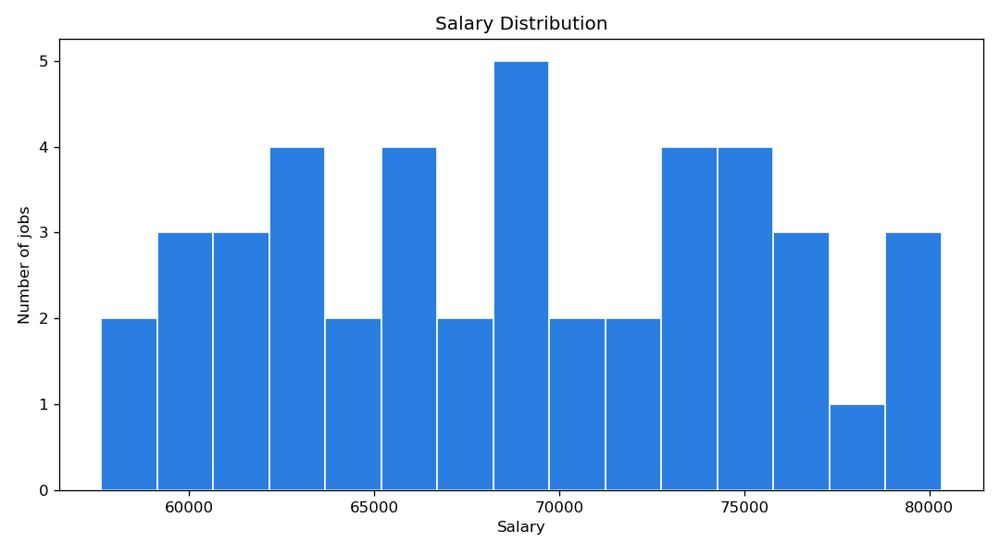

# Job Market Analysis

- **Total jobs analysed:** 60
- **Jobs with salary data:** 44
- **Median salary:** 68,765
- **Average salary:** 68,904

## Top hiring companies

| Company | Openings |
|---|---|
| Siemens | 14 |
| SAP | 10 |
| Delivery Hero | 9 |
| N26 | 6 |
| Personio | 5 |
| HelloFresh | 5 |
| Bosch | 3 |
| Celonis | 3 |
| Zalando | 3 |
| Trivago | 2 |

## Top locations by openings

| Location | Openings |
|---|---|
| Berlin | 13 |
| Frankfurt | 11 |
| Munich | 11 |
| Stuttgart | 9 |
| Cologne | 9 |
| Hamburg | 7 |

## Average salary by location

| Location | Avg salary | Jobs |
|---|---|---|
| Frankfurt | 74,624 | 9 |
| Munich | 74,144 | 7 |
| Stuttgart | 68,856 | 7 |
| Berlin | 66,433 | 9 |
| Cologne | 64,007 | 6 |
| Hamburg | 62,872 | 6 |

## Charts

